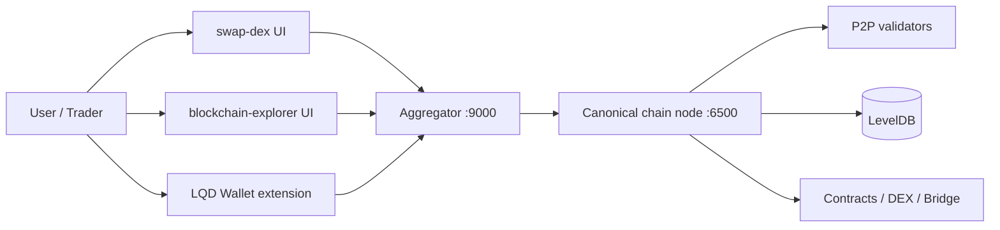

# Proof of Dynamic Liquidity (PoDL) Production Guide

This guide is written for three roles:
- `operator / owner` who deploys and maintains the network
- `miner / validator` who runs consensus nodes
- `developer / user` who integrates with the chain, wallet, DEX, and explorer

It is based on the current repository code and the live services used in this project.

## 1) System Overview

PoDL is a custom blockchain stack with:
- core blockchain execution
- PoDL consensus and validator selection
- multi-validator P2P sync
- native smart contracts
- native DEX with factory + pair contracts
- LP-backed validation
- dynamic liquidity routing
- protocol arbitrage
- explorer, wallet, bridge, and DEX UIs



## 2) Core Roles

### Operator / Owner
The operator boots the canonical node, deploys the shared DEX factory once, and keeps the shared contract address stable for everyone.

Responsibilities:
- start the canonical chain node
- start the aggregator
- start wallet/explorer/DEX frontends
- deploy the canonical DEX factory once
- keep DB paths and ports stable
- monitor health, blocks, validators, and bridge relayer status

### Miner / Validator
The miner runs a chain node with mining enabled.

Responsibilities:
- sync from canonical node or peer
- keep a unique DB path
- register as a legacy validator or LP-backed PoDL validator
- participate in quorum voting
- keep P2P port reachable

### Developer / User
The developer or end user typically:
- creates or imports a wallet
- sends native LQD
- imports tokens
- swaps on the DEX
- adds/removes liquidity
- locks LP for validation
- inspects transactions and blocks in the explorer

## 3) Ports and Services

Common default ports in this repo:

| Service | Default |
|---|---:|
| Canonical chain HTTP | `6500` |
| Canonical chain P2P | `6100` |
| Wallet server | `8080` |
| Aggregator | `9000` |
| DEX UI | `3000` |
| Explorer UI | `3001` |

The current canonical node can also be discovered by the DEX UI via:
- `GET /dex/current`

## 4) Production Startup Order

### Step 1: Start the canonical chain

```bash
go run main.go chain \
  -port 6500 \
  -p2p_port 6100 \
  -db_path 5000/evodb \
  -validator 0xYOUR_VALIDATOR \
  -stake_amount 3000000 \
  -mining=true
```

Notes:
- `-db_path` must be unique per node.
- `-validator` is required.
- If you want a sync-only validator, use `-mining=false`.

### Step 2: Start the wallet server

```bash
go run main.go wallet -port 8080 -node_address http://127.0.0.1:6500
```

### Step 3: Start the aggregator

```bash
go run main.go aggregate \
  -port 9000 \
  -canonical http://127.0.0.1:6500 \
  -wallet http://127.0.0.1:8080
```

### Step 4: Start the frontends

Run the DEX UI and explorer UI on their own dev servers or builds.

## 5) Owner Workflow

### First-time DEX deployment

The shared DEX should be deployed once by the owner. After that, all users should use the same canonical factory address.

Owner flow:
1. Open the DEX UI.
2. Connect the owner wallet.
3. Go to `Settings`.
4. Deploy the fresh DEX factory once.
5. Keep that factory address as the canonical DEX.

After this:
- public users should not redeploy a new factory
- all users should auto-load the canonical factory
- pair creation, swaps, and liquidity actions should route through the shared factory

### Factory vs pair

Important distinction:
- `factory` contract = shared registry and router entrypoint
- `pair` contract = actual liquidity pool state

Users should never manually point the DEX UI at a pool contract when they want factory actions.

## 6) User Workflow

### A. Create wallet
Use the explorer wallet or the LQD extension wallet to create or import a wallet.

### B. Import tokens
In the DEX UI, import token contracts by address.

### C. Create a pair
1. Select token A and token B.
2. Approve the pair target if needed.
3. Click `Create Pool`.
4. The pair contract becomes the active pool after creation.

### D. Add liquidity
1. Open the pool screen.
2. Enter one side amount.
3. The other side auto-calculates from the current pool ratio.
4. Approve tokens if needed.
5. Click `Add Liquidity`.

### E. Swap
1. Select the input and output token.
2. Enter amount.
3. Review quoted output, price impact, and fee.
4. Approve token input if required.
5. Execute swap.

### F. Remove liquidity
1. Open the pool.
2. Enter LP amount to burn.
3. The UI shows expected token outputs.
4. Confirm remove liquidity.

### G. Lock LP for validation
1. Go to `Validate`.
2. Enter LP amount and lock duration.
3. Lock LP.
4. Start the validator node with the LP-backed validator settings.

## 7) Miner / Validator Workflow

### Legacy validator
If you want the older PoS mode:

```bash
go run main.go chain \
  -port 5001 \
  -p2p_port 6001 \
  -db_path 5001/evodb \
  -remote_node 127.0.0.1:6100 \
  -validator 0xYOUR_VALIDATOR \
  -stake_amount 4000000 \
  -mining=false
```

### LP-backed PoDL validator
If you want the LP-based mode:

```bash
go run main.go chain \
  -port 5001 \
  -p2p_port 6001 \
  -db_path 5001/evodb \
  -remote_node 127.0.0.1:6100 \
  -validator 0xYOUR_VALIDATOR \
  -dex_address 0xDEX_FACTORY_ADDRESS \
  -lp_token_amount 1000000 \
  -mining=false
```

Notes:
- the validator should sync from the canonical node first
- P2P ports must be reachable
- use a unique DB path for each validator

## 8) Developer Workflow

### Local build

```bash
go build ./...
```

Frontend builds:

```bash
cd swap-dex && npm run build
cd ../blockchain-explorer && npm run build
cd ../lqd-wallet-extension
```

### Key repo modules

| Module | Purpose |
|---|---|
| `BlockchainComponent/` | chain, consensus, txs, DEX, bridge, validators |
| `BlockchainServer/` | HTTP API for chain node |
| `AggregatorServer/` | proxy and aggregation layer |
| `WalletServer/` | wallet actions and contract tx signing |
| `swap-dex/` | DEX UI |
| `blockchain-explorer/` | explorer UI + wallet dashboard |
| `lqd-wallet-extension/` | browser extension wallet |

### DEX contract semantics

The DEX is designed as a public shared factory:
- one canonical factory address
- any user may create pairs on it
- any user may add/remove liquidity
- any user may swap subject to approvals and balances

## 9) API Quick Reference

### Node
- `GET /health`
- `GET /getheight`
- `GET /blockchain`
- `GET /transactions/recent`
- `GET /balance?address=0x...`
- `GET /basefee`

### Contracts
- `POST /contract/call`
- `POST /contract/deploy`
- `POST /contract/deploy-builtin`
- `GET /contract/getAbi?address=0x...`
- `GET /contract/storage?address=0x...`

### DEX discovery
- `GET /dex/current`

### Bridge
- `GET /bridge/requests`
- `GET /bridge/tokens`
- `POST /bridge/lock_bsc`
- `POST /bridge/burn_lqd`

### Wallet server
- `POST /wallet/new`
- `POST /wallet/import/mnemonic`
- `POST /wallet/import/private-key`
- `GET /wallet/balance?address=0x...`
- `POST /wallet/send`
- `POST /wallet/contract-template`

## 10) Performance and Limits

### Block gas
The current maximum block gas is:
- `500,000,000`

The minimum block gas target is:
- `21,000,000`

### Simple transfer throughput
Simple native transfers cost approximately:
- `21,000` gas

That means a theoretical upper bound is:
- `500,000,000 / 21,000 ≈ 23,809` simple transfers per block

This is a theoretical ceiling, not a guaranteed real-world number.

### Real throughput is lower because:
- contract calls cost more gas
- storage writes cost more gas
- consensus and P2P sync add delay
- DEX and bridge operations are heavier than plain transfers

### Consensus and mining cadence
- target block time is about `2s`
- tx verification uses parallel workers
- dynamic liquidity runs every `100` blocks

## 11) Rewards and Economics

Current reward model:
- proposer validator: `40%`
- LP providers: `30%`
- long-lock LP: `5%`
- other validators: `12%`
- tx participants: `2%`
- treasury: `11%`

Emission:
- genesis reward starts at `20 LQD`
- halving period: `63,115,200` blocks
- floor: `1 satoshi`

## 12) Security and Production Notes

### Recommended production practices
- use a dedicated server for the canonical node
- keep validator DB paths unique
- secure P2P ports
- back up wallet credentials
- deploy the DEX factory once and keep the address canonical
- keep bridge relayer keys isolated
- monitor `health`, `height`, `validators`, and transaction history

### Important caveats
- bridge support is still partial
- this chain has some custom economics and DEX logic that should be audited before mainnet
- treat the canonical DEX factory as immutable infrastructure once deployed

## 13) Quick Troubleshooting

### DEX says pool contract instead of factory
Use the owner deployment flow to set the canonical factory address.

### Add liquidity fails
Check:
- pair exists
- both tokens are selected
- approvals are given
- the UI is pointing to the factory, not a pool contract

### Explorer shows no txs
Check:
- aggregator is running
- node URL is correct
- wallet or explorer tab is not using stale local cache

### Validator does not sync
Check:
- P2P port is reachable
- remote node address is correct
- DB path is unique
- validator registration completed successfully

## 14) Recommended Launch Checklist

1. Start canonical node.
2. Start wallet server.
3. Start aggregator.
4. Deploy the shared DEX factory once.
5. Verify `GET /dex/current`.
6. Open DEX UI and confirm the factory auto-loads.
7. Open explorer and verify transaction history.
8. Launch validators.
9. Register LP-backed validators if using PoDL mode.
10. Test swap, add liquidity, remove liquidity, and LP lock/unlock.

## 15) Final Positioning

PoDL is best described as:
- a custom blockchain
- with a shared on-chain DEX factory
- LP-backed consensus power
- dynamic liquidity routing
- and a protocol-level arbitrage engine

That combination is the project’s main differentiator.
